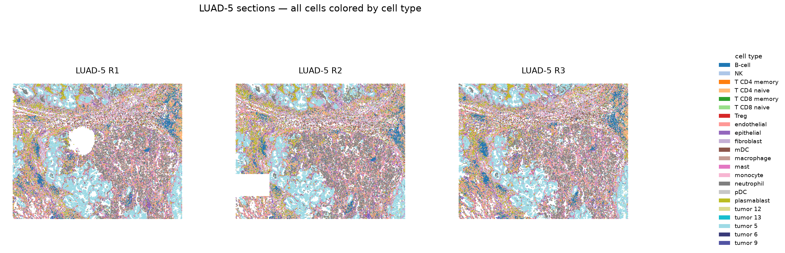
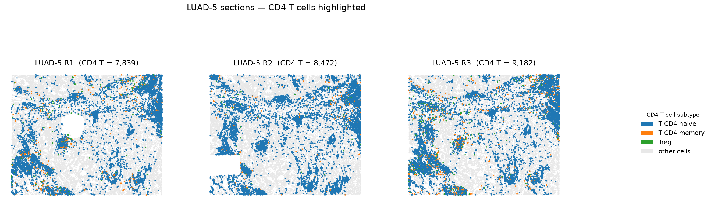
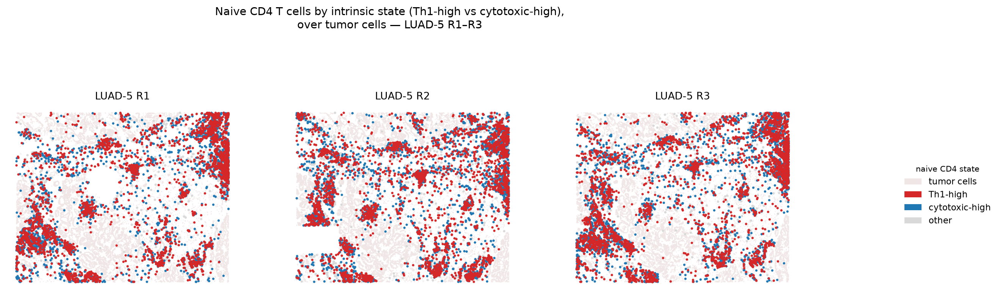
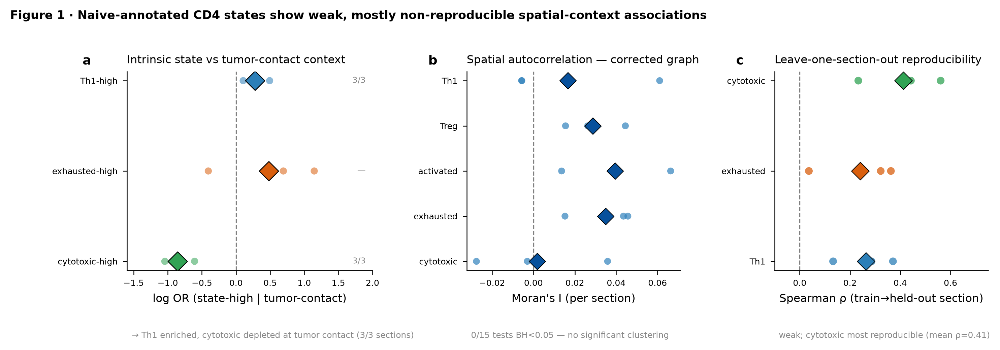
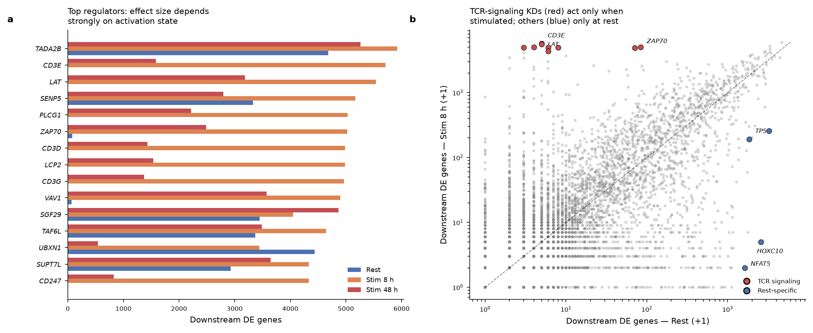
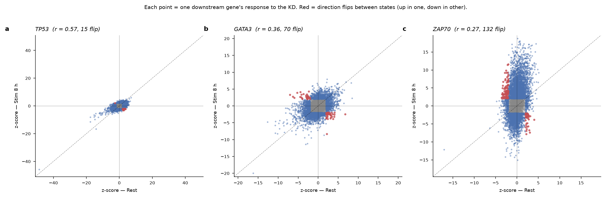
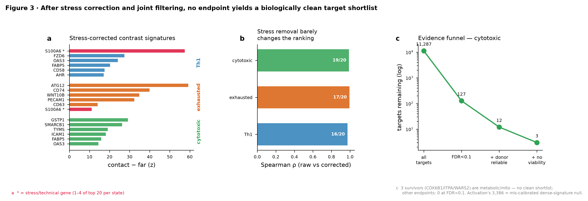

# Do naive-annotated CD4⁺ T cells in NSCLC occupy distinct spatial contexts as distinct functional states — and can a CD4⁺ Perturb-seq atlas nominate a regulator for each?

**Hackathon report · Researcher track**
Species: human · Reference: GRCh38 · Last updated: 2026-07-13

---

> **The one sentence.** We built a transparent bridge from a genome-scale CD4⁺ Perturb-seq atlas to tumor spatial transcriptomics to ask whether spatially distinct CD4⁺ T-cell states can be matched to distinct candidate regulators. The bridge works methodologically, but the honest result is largely negative: intrinsic states show only weak, mostly non-reproducible spatial-context associations, and **after correct multiple-testing control, stress correction, and reliability/viability filtering, no endpoint yields a biologically clean target shortlist.** This is a **hypothesis-generation instrument, not a source of causal or predictive claims**, and its most useful output this round is a calibrated *negative* result — that FDR alone cannot select a target here. Every projected map is *exploratory — not experimentally validated*.

---

## 1. Question and framework

Standard annotation labels a cell a naive CD4⁺ T cell and stops there. But two cells with that label can sit in very different places in a tumor — one pressed against the tumor edge, one out in tumor-distal stroma. This project asks a two-part question:

> *Within one annotated CD4⁺ T-cell type, do spatially distinct functional states exist? And if so, can a genome-scale CD4⁺ Perturb-seq atlas nominate a different candidate regulator for each — given that a knockdown's effect itself depends on whether the T cell is resting or activated?*

The framework has three moving parts, kept deliberately transparent:

1. **Resolve one annotated identity spatially** — score each naive-annotated CD4⁺ cell's intrinsic program (Th1, exhausted, cytotoxic, activated, Treg) from T-cell expression *only*, and its spatial context (distance to tumor, neighbor cell-type composition) from the environment *only*, so the two views are independent by construction.
2. **Ask the Perturb-seq atlas which knockdown aligns with each state's spatial contrast** — a transparent vector-alignment against a *measured* CD4⁺ response, not a learned prediction.
3. **Respect activation context** — knockdown effects are reported per condition (Rest / Stim 8 h / Stim 48 h), and are filtered for donor-reproducibility and viability before any candidate is trusted.

**Two datasets, joined on a shared gene space.**

| | Perturbation atlas | Spatial atlas |
|---|---|---|
| **Source** | Marson–Pritchard genome-scale CD4⁺ Perturb-seq (CRISPRi, 4 donors) | CosMx NSCLC (He 2022) |
| **Measures** | logFC / z-score of every gene after each CRISPRi knockdown | single-cell spatial location + expression |
| **Key axis** | conditions Rest / Stim 8 h / Stim 48 h | 765,771 cells · 960-gene panel · 22 cell types |

The cross-platform overlap is small and always reported: **501 genes** (CosMx intersected with the knockdown differential-expression table, used at gene level and for the held-out check) and **912 genes** (CosMx intersected with the pseudobulk profiles, kept separate). A one-week linkage of two datasets never designed to be joined has a hard inferential ceiling; the value is in a calibrated shortlist-or-not answer, not a causal claim.

The spatial substrate is the three LUAD-5 sections (R1–R3). Colored by cell type, they show the tissue architecture the analysis runs on — tumor nests, stromal bands, and immune infiltrate:

*Fig 0a. The three LUAD-5 tumor sections, every cell colored by its annotated type (22 types, shared legend). These are the tissue maps every downstream spatial analysis is computed on.*

The CD4⁺ T cells this project focuses on — naive, memory, and Treg — are a small, spatially dispersed fraction of those cells; highlighting them against a grey background of all other cells shows how they thread through the tissue:

*Fig 0b. The same three sections with only the CD4⁺ T-cell subtypes colored (naive, memory, Treg); all other cells are grey. The naive-annotated CD4⁺ cells (blue) are the substrate for the state × context analysis in §2.*

---

## 2. Figure 1 — Same annotation, distinct spatial contexts (weak, mostly non-reproducible)

**Message: naive-annotated CD4⁺ T cells show weak but real intrinsic-state × spatial-context associations on the tumor-distance axis; other context axes are under-sampled, spatial autocorrelation is not significant once the graph is corrected, and cross-section reproducibility is low.**

We restricted to the 23,889 naive-annotated CD4⁺ T cells in LUAD-5 R1–R3, scored intrinsic programs from T-cell expression only, and defined spatial context from the environment only. Two context descriptors are computed for each naive CD4⁺ cell, using nothing but where the cell sits and what surrounds it:

- **Distance to tumor** — the straight-line distance from the cell to the nearest tumor cell, computed per section. This places the cell on a tumor-contact-to-tumor-distal axis.
- **Neighbor cell-type composition** — for every other cell within a 50 µm radius, we tally what type it is (macrophage, fibroblast, B cell, endothelial, tumor, …) and turn those counts into fractions. The result is a local-environment profile: e.g. "this naive CD4⁺ cell sits in a neighborhood that is 40% macrophage and 20% fibroblast." This describes the microenvironment a cell is embedded in without using the cell's own expression, so the environment view stays independent of the intrinsic-state view.

Testing each intrinsic state against each context per section:

- **Only the tumor-distance axis is informative.** Th1-high cells are enriched at tumor contact (log OR +0.28, sign-consistent across all 3 sections) and cytotoxic-high cells are depleted at contact (log OR −0.86, 3/3); the exhausted association is not section-consistent. The myeloid-rich / fibroblast-rich / B-cell-rich contexts are **degenerate for naive CD4⁺ cells** — almost no naive cell sits in those neighborhood tertiles, so those cells cannot be scored, a real sampling limitation rather than a null result.
- **The states do not form coherent spatial territories.** We tested whether cells with a high program score cluster together in space (spatial autocorrelation, measured by Moran's I) rather than being scattered at random. Using a neighbor graph restricted to genuinely adjacent cells and correcting for how many transcripts each cell captured, **no program in any section shows significant spatial clustering** (0 of 15 section×program tests survive multiple-testing correction). An earlier version reported "significant but weak" clustering; that was partly an artifact of connecting cells that were too far apart or across imaging-tile boundaries. In other words, the program scores vary cell-to-cell without forming spatial patches. (Graph-construction details in §6.3.)
- **The signal does not reproduce across tissue sections.** A finding is only trustworthy if it holds on data that did not help define it. We tested this with a **leave-one-section-out** check: build the state-vs-context contrast (and the resulting ranked list of candidate knockdowns) using only two of the three sections, then measure how well that ranking still holds on the held-out third section (rank agreement measured by Spearman correlation, where 1 = identical ranking and 0 = unrelated). The agreement averages only **0.31** (cytotoxic best at 0.23–0.56; Th1/exhausted 0.04–0.37). An earlier version reported 0.89–0.93, but that number was inflated because the contrast had been defined using all three sections at once — testing on data it was built from. The honest, held-out value is 0.31. This matters because R1–R3 are three sections of **one patient**, not independent biological replicates, so even this is a within-patient estimate.

The one reproducible finding is the tumor-distance effect above — a quantitative log-OR result (panel (a) below). To place it in tissue, the map below colors each naive CD4⁺ cell by its dominant state (Th1-high vs cytotoxic-high) over a grey tumor-cell background:

*Fig 1a-map. The three LUAD-5 sections with tumor cells as a grey background and naive CD4⁺ T cells colored by dominant intrinsic state (red = Th1-high, blue = cytotoxic-high, grey = neither), from a median split of the Th1 and cytotoxic program scores. The map is a tissue-level view of where the two states sit; the contact-enrichment effect itself is the quantitative log-OR test in panel (a), not something read off this scatter by eye. Exploratory — not experimentally validated.*

*Fig 1. **(a)** Intrinsic-state vs tumor-contact association (log OR; diamonds = 3-section mean, dots = per section); Th1 enriched and cytotoxic depleted at contact, both 3/3 consistent. **(b)** Moran's I per section on the corrected graph — 0/15 significant at BH < 0.05. **(c)** Leave-one-section-out ranking reproducibility; weak, cytotoxic most reproducible. Exploratory — not experimentally validated.*

---

## 3. Figure 2 — Perturbation effects depend on activation context

**Message: knockdown effects genuinely differ across Rest / Stim 8 h / Stim 48 h, but only a small, reliability-filtered subset is trustworthy; the raw flip count is an upper bound.**

A knockdown's effect is not fixed: the same gene knockdown can push a T-cell program *up* in resting cells but *down* in stimulated cells, or vice versa. We call that a **direction flip** — the knockdown's effect on a program reverses sign between the resting and the stimulated state. Screening every (target gene, program) pair for such a reversal between Rest and Stim 48 h, we compute each program's effect as the average expression change over that program's marker genes, and count a flip when the effect is non-negligible in both states (magnitude at least 0.10 on the log-fold-change scale) and points in opposite directions. Across **55,510 pairs, 5,736 flip direction** between the two states.

**This 5,736 is an upper bound, not a result.** The quality-control breakdown shows why: **2,236 of the 5,736 flips are incomplete** — in at least one of the two states, the knockdown moved *no* downstream gene by a statistically significant amount (an expression change is measured, but none of it clears significance), so the apparent program-level reversal rests on noise (24,345 pairs have no significant downstream gene in at least one state, 9,570 in both). Each program is defined by only ~30 marker genes, and the effect-magnitude cutoff is arbitrary with no donor-to-donor error bar attached. The trustworthy count after requiring complete, reliable data in both states is much smaller; the fixed cutoff should be replaced by a proper statistical test for a state-by-knockdown interaction, with multiple-testing correction (§6). TCR-signaling knockdowns (ZAP70, CD3E, VAV1, PTPRC) do show strong activation-state-dependent effects — a reasonable sanity signal that the screen tracks activation biology — but we stop short of calling any single flip a validated positive control.

*Fig 2a. Left: top regulators' effect sizes across states. Right: rest-vs-stim downstream DE-gene counts — TCR-signaling knockdowns (red) act mainly when stimulated; a rest-specific set (blue) acts at rest.*

*Fig 2b. Each point is one downstream gene's response; red points reverse direction between states. TP53 (r = 0.57) is largely state-stable; GATA3 (r = 0.36) and ZAP70 (r = 0.27) are progressively more context-dependent.*

**Reliability is the binding constraint.** Using the atlas's own quality fields, a target is **reliable** when its knockdown reproduces across the four donors (average donor-to-donor concordance above 0.2), moves at least 5 downstream genes, and shows a significant on-target knockdown. Only **1,144 of 11,287 targets (10%)** clear this bar. A separate **viability / general-disruption flag** (top-decile total DE, bottom-decile cell recovery, or a curated essential/broad-transcription list) marks **1,942 targets (17%)**. Both are carried as annotations into Figure 3, because a "reversal" driven by a broadly toxic knockdown is a weaker claim than a specific state shift.

---

## 4. Figure 3 — Linking spatial contrasts to perturbations, and the evidence funnel

**Message: after stress/technical correction the spatial contrast is no longer stress-dominated, but the aligned perturbation ranking carries no biologically specific signal; and passing FDR + reliability + viability simultaneously leaves no clean candidate for any endpoint.**

To ask a genuinely niche-specific question we contrasted **tumor-contact vs tumor-far cells within a fixed intrinsic state** (Th1-high, exhausted-high, cytotoxic-high naive cells), matching contact and far cells on total transcript count per cell within each section (so a difference is not just one group of cells being captured more deeply), computing per-section fold-changes on the 501 shared genes, and keeping only genes that agree in direction across at least 2 of the 3 sections. Heat-shock, ribosomal, mitochondrial, and broad-stromal genes are flagged.

- **The corrected signature is no longer stress-dominated:** only 1–4 of the top-20 genes per state are stress/technical (vs the earlier HSP/S100/VIM domination), and the surviving top genes are plausible tumor-proximity biology (CD74, PECAM1, ICAM1, GZMA, CCL3, IL15RA).
- **But stress removal barely changes the perturbation ranking** (raw-vs-corrected Spearman ρ = 0.97–0.99, top-20 overlap 16–19/20). This cuts both ways: the ranking was *not* being driven by the stress genes, but the aligned top targets (ATAD5, ZNF574, LSM10, PSIP1 …) are generic replication/housekeeping genes with no T-cell-state rationale — i.e. the alignment carries no biologically specific signal.

*Fig 3. **(a)** Stress-corrected contact−far signatures (crimson * = stress/technical gene). **(b)** Raw-vs-corrected ranking Spearman — stress removal barely moves the ranking. **(c)** Evidence funnel for the cytotoxic endpoint: 11,287 → 127 (FDR < 0.1) → 12 (donor-reliable) → 3 (no viability flag). Exploratory — not experimentally validated.*

**The FDR audit — the earlier "23 hits" was a null-calibration artifact.** The earlier report claimed "only cytotoxic enhancement survives BH-FDR: 23 targets, ZMAT1 0.024". That is arithmetically impossible for a *per-target* permutation p-value: with 1,000 permutations and add-one correction the smallest possible p is 1/1001 ≈ 0.001, so BH across ~11,100 targets gives even the best target q ≈ 0.48, never 0.024. Auditing the code confirmed a **pooled null** (all targets × all permutations concatenated into one ~11 M-value pool), which assumes every target is exchangeable and ignores per-target response variance. Recomputing with a proper **per-target** null and comparing both (`S1_fdr_audit.csv`):

| endpoint | per-target FDR < 0.1 | pooled FDR < 0.1 | verdict |
|---|---|---|---|
| cytotoxic enhancement | 127 | 23 | only endpoint credible under *both* nulls |
| activation enhancement | 3,386 | 0 | 30% pass → null mis-calibrated for a dense signature, not credible |
| Th1 / exhaustion-reversal / Treg-reduction | 0 | 0 | no signal under either null |

**The evidence funnel ends with no clean shortlist.** Applying FDR (per-target) + donor-reliability + no-viability-flag simultaneously:

- **cytotoxic enhancement** — the only endpoint with a credible null — narrows 11,287 → 127 → 12 → **3 survivors (COX6B1, ITPA, WARS2)**, which are mitochondrial / tRNA-synthesis / nucleotide-metabolism genes with **no cytotoxicity rationale**.
- **activation enhancement** produces 46 "clean" targets, but its null is mis-calibrated (30% of all targets pass), so these are not credible discoveries.
- **Th1, exhaustion-reversal, Treg-reduction** — 0 at FDR < 0.1.

The honest bottom line: **the pipeline is sound but selects no biologically defensible target.** As the methodology review put it, a clean shortlist of zero is itself the result — it shows that FDR alone cannot pick a target on this two-dataset linkage. Earlier candidate claims (PTPN2, MBTPS1, DTWD1, CDK9) came from the pooled null or a marker-KO proxy, are not reproduced by the corrected analysis, and are **retracted**. Figure 4 (representative target tissue maps) is deliberately **not built** — with no clean candidate, any such map would re-package a baseline state map as a target effect.

---

## 5. Conclusion and limitations

**What stands.** The bridge from a CD4⁺ Perturb-seq atlas to CosMx NSCLC is methodologically transparent and reusable: an independent state × context design (Fig 1), an activation-context perturbation screen with a reliability filter (Fig 2), and a stress-corrected contrast with a fully audited FDR + reliability + viability funnel (Fig 3). The one robust *directional* finding, stable across null choice, is that **cytotoxic enhancement is the only endpoint with any transferable signal**; the reversal/reduction endpoints have none.

**What does not.** No endpoint produces a clean, biologically credible target shortlist on this dataset. This is a genuine, calibrated negative result, not a failure to compute one.

**Limitations, plainly:**

- **In-vitro → in-tissue gap.** Perturb-seq measures cultured CD4⁺ responses; projecting onto tumor tissue is a hypothesis, not a measurement.
- **~500-gene shared space.** All cross-platform alignment runs on 501 (gene-level) / 912 (state-matching) shared genes; transfer on this overlap is unstable and the overlap size is reported with every score.
- **Single patient, single histology.** LUAD-5 R1–R3 are three sections of one patient — **not** biological replicates; cross-patient and cross-histology generalization is untested.
- **Context axes under-sampled.** Naive CD4⁺ cells are almost absent from myeloid/fibroblast/B-cell-rich neighborhoods, so only the tumor-distance context axis could be tested.
- **Weak spatial structure.** Corrected Moran's I is not significant (0/15) — programs do not form coherent spatial territories at this resolution.
- **FDR alone is insufficient.** Even a correctly computed per-target FDR, without a credible null calibration and reliability/viability filtering, over-selects; the activation endpoint is the cautionary example.
- **Every map is an exploratory virtual-perturbation projection — not an experimentally validated prediction.**

**What would move this forward:** a larger shared-gene panel (or a probe-matched spatial platform); cross-patient and cross-histology replication (CosMx BCC); a donor-term condition×perturbation interaction model with FDR to replace the flip cutoff; and a marker-free, reference-projected state definition to remove residual circularity.

---

## 6. Supplementary — methods and QC

### 6.1 Perturbation data and QC
The atlas ships precomputed, condition-resolved signatures (`GWCD4i.DE_stats.h5ad`, `pseudobulk_merged.h5ad`); the 22-million-cell raw data were never reprocessed. Every gene was knocked down (CRISPRi) in all three states (~11,300 per state); on-target knockdown was detected for ~60% of targets (Rest 61%, Stim 8 h 63%, Stim 48 h 64%). *(Fig M1 — atlas overview.)*

### 6.2 Intrinsic-state scoring and the all-CD4 note
Program scores use Scanpy's gene-set scoring (`score_genes`) on curated marker panels (cytotoxic GZMB/GZMK/…; exhausted PDCD1/HAVCR2/…; activated CD69/IL2RA/…; Treg FOXP3/IL2RA/CTLA4; Th1 TBX21/IFNG/CXCR3/STAT1). A positive score is a *relative* measure (the marker set expressed above a matched set of control genes), not an absolute claim that a cell "is" exhausted — the naive-annotated positivity itself needs validation. A prior analysis clustered the combined all-CD4 substrate (naive + memory + Treg); a data check showed intrinsic scores are **identical** within naive-annotated cells alone (correlation 1), so all-CD4 added only a subtype-identity axis (clusters became FN1 = 86.8% Treg, FN2 = 80.2% memory) rather than spatial niches. The primary analysis here is therefore run **within the naive annotation**. *(Fig M2 — program scores by subtype; the 19-feature-niche UMAP and all-CD4 clusters are supplementary.)*

### 6.3 Spatial context, Moran's I, reproducibility
Context features: nearest-tumor distance (per section) and neighbor cell-type composition within 50 µm. Moran's I: per-program per-section, 6-NN graph with a **40 µm max-distance cutoff and no cross-FOV edges**, on `n_counts`-residualized scores, 199-permutation null, BH across 15 tests (`MI_morans_recheck.csv`). Reproducibility: leave-one-section-out ranking Spearman (`REP_leave_one_section.csv`).

### 6.4 Contrast, alignment, filters, FDR audit
Contact-vs-far: within-state, `n_counts`-matched, section-pseudobulk logFC on 501 shared genes, ≥ 2/3 direction agreement, stress/ribo/mito/stromal flag; raw-vs-corrected ranking sensitivity in `S2c_sensitivity.csv`. Held-out FDR audit: per-target vs pooled permutation null, add-one p, BH per endpoint (`S1_fdr_audit.csv`, `S1_fdr_audit_note.md`). Reliability/viability: `S3_reliability_viability.csv`. Evidence funnel: `evidence_funnel.csv`, `clean_shortlist.csv`. *(Fig M3 — activation-context trajectories, illustrative only.)*

### 6.5 State-matching (negative result, supplementary)
Per-cell assignment of each tumor CD4⁺ cell to its most-similar Perturb-seq condition collapsed onto Rest for 81.7% of cells at mean Pearson ~0.17–0.19, so it is reported as a negative result and is not used to drive scoring.

---

## 7. How we used Claude (Claude Use)

- **Drove a remote cluster autonomously** — read host config and built/reused conda environments at a scratch prefix.
- **Reported a calibrated negative result** — rather than force a positive finding, it built the evidence funnel to its honest end (no clean shortlist) and declined to build Figure 4.
- **Kept the human in the loop** with structured decisions and cross-session memory.

### Authoring with a purpose-built manuscript specialist

Beyond the analysis, this report was drafted and revised by a **custom "Writer" specialist agent** — a Claude configuration dedicated to scientific-manuscript work rather than general assistance:

- **A manuscript house style, applied without re-instruction.** The specialist writes each section as an argument (question → setup → observation → interpretation), builds one figure around one claim with conclusion-style captions, and follows each number with what it demonstrates.
- **Hypothesis-generation framing enforced.** Under a standing rule that this work is prioritization rather than causal or predictive inference, it rewrote any sentence drifting toward a causal or predictive claim into calibrated hypothesis-generation language — the reason every projected map carries an *exploratory — not experimentally validated* label.
- **A bilingual author–review loop.** It kept an English master as the single source of truth and generated a faithful Korean twin for review; Korean margin comments were translated and folded back into the English master, then the Korean file regenerated — so a Korean-reading author could steer an English manuscript without the two versions drifting.
- **Figures kept honest to their computation.** It enforced that a figure's title claim only what the producing code measured — regenerating a spatial map whose title asserted a directional enrichment into a descriptive-only title, with the enrichment attributed to the separate quantitative test.

---

## Appendix — Artifacts underlying this report

| Item | File | Role |
|---|---|---|
| **Fig 1 — state × context + Moran + reproducibility** | `fig1_state_context.png` | main |
| **Fig 2a — regulator effect by state** | `fig2_context.png` | main |
| **Fig 2b — per-gene direction flips** | `fig3_flips.png` | main |
| **Fig 3 — corrected contrast + sensitivity + funnel** | `fig3_integration.png` | main |
| FDR audit note + table | `S1_fdr_audit_note.md`, `S1_fdr_audit.csv` | key |
| Evidence funnel + shortlist | `evidence_funnel.csv`, `clean_shortlist.csv` | key |
| State × context association | `F1_state_context_assoc.csv` | key |
| Moran's I (corrected graph) | `MI_morans_recheck.csv` | key |
| Leave-one-section-out reproducibility | `REP_leave_one_section.csv` | key |
| Stress-corrected signatures + sensitivity | `S2c_signature_{Th1,exhausted,cytotoxic}.csv`, `S2c_sensitivity.csv` | key |
| Reliability + viability annotation | `S3_reliability_viability.csv` | key |
| Fig M1 / M2 / M3 (supplementary) | `fig1_overview.png`, `cd4_allcd4_program_scores_by_subtype.png`, `candidate_trajectories.png` | supp |
| Flip-screen QC (recomputed) | `S5_flip_qc.json`, `S5_flip_recompute.csv` | supp |
| Superseded (old relevance map, pre-correction held-out) | `niche_target_relevance_map.png`, `heldout_confirmation.png`, `fig3_niche_contrast.png`, `fig_heldout_corrected.png` | superseded |
